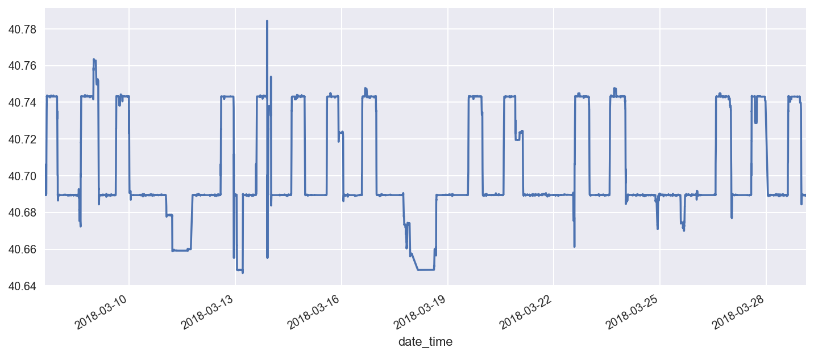

# Visualize Google Location History:

Here is an easy way to analyze your google history data.

In order to get this data go to: https://takeout.google.com/settings/takeou and _only_ tick “location history” for download. It might take a few hours or days before Google sends you an email but once that is done you can download a .json file with all of your location history. I downloaded mine and I will see what insights we can gain from it!

## Loading Required Packages and Importing the Data:


```python
import os
import sys

import pandas as pd
import numpy as np
import psycopg2

import seaborn as sns
import matplotlib.pyplot as plt

# from plotly.offline import iplot, init_notebook_mode
# import cufflinks as cf
# init_notebook_mode(connected=True)
# cf.go_offline()

%matplotlib inline
%config InlineBackend.figure_format = 'retina'
pd.options.mode.chained_assignment = None  # default='warn'

from pylab import rcParams
rcParams['figure.figsize'] = 12, 5

import folium
from folium import plugins


import json
```


```python
def read_and_clean_data(data_location):

    with open("/Users/alexpapiu/Downloads/Takeout/Location History/Location History.json") as data_file:
        data = json.load(data_file)

    df = pd.DataFrame(data["locations"])
    
    df["date_time"] = pd.to_datetime(df["timestampMs"], unit = "ms")
    df["lat"] = df["latitudeE7"]/ 10.**7
    df["long"] = df["longitudeE7"] / 10.**7
    return df
    
```

### Location Time-Series:


```python
df.head(10000).set_index("date_time")["lat"].plot()
```


    <matplotlib.axes._subplots.AxesSubplot at 0x168693898>





Interesting patterns - one can clearly see the weekly and daily periodicity - in terms of work and home locations.

## Building a Heat Map:


```python
temp = df[df["date_time"] > "2018-02-01"][["lat", "long"]].values.tolist()
```


```python
# def get_colors(n):
#     """
#     color scales based on the new matplotlib scales with slight modifications
#     """

#     scales = [["#f2eff1", "#f2eff1", "#451077", "#721F81", "#9F2F7F", "#CD4071",
#     "#F1605D",  "#FD9567",  "#FEC98D", "#FCFDBF"],

#     ["#f2eff1", "#f2eff1", "#3E4A89", "#31688E", "#26828E", "#1F9E89", "#35B779",
#     "#6DCD59", "#B4DE2C", "#FDE725"],

#     ["#f2eff1", "#f2eff1", "#4B0C6B", "#781C6D", "#A52C60", "#CF4446",
#     "#ED6925", "#FB9A06", "#F7D03C", "#FCFFA4"]]

#     return(scales[n-1])

# def return_color_scale(n):
#     df = pd.Series(get_colors(n))
#     df.index = np.power(df.index/10, 1/1.75)
#     return df.to_dict()

# map_osm = folium.Map(tiles='cartodbdark_matter',
#                      location = [40.7158, -73.9970],
#                      zoom_start=13)

# map_osm.add_children(plugins.HeatMap(temp, min_opacity = 0.35,
#                                      radius = 13, blur = 10,
#                                      gradient = return_color_scale(1),
#                                      #name = descp
#                                     ))
```
